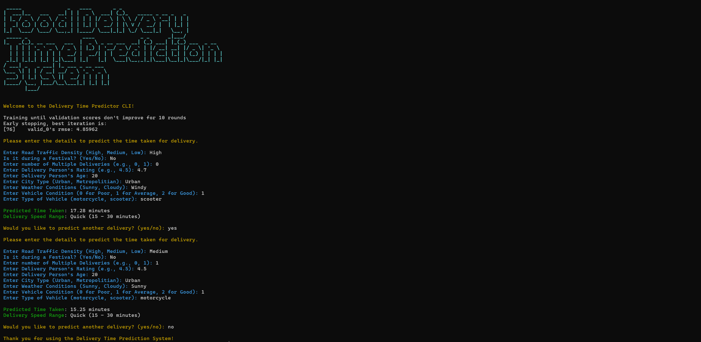

# Smart-Delivery-Time-Predictor

## Introduction

Managing a food delivery service comes with the challenge of ensuring meals arrive on time while maintaining quality. Unpredictable factors like traffic congestion and adverse weather conditions can cause delays, affecting customer satisfaction.

To tackle this issue, I have developed Smart-Delivery-Time-Predictor using machine learning.By leveraging historical delivery data, real-time traffic updates, and current weather conditions, our system accurately estimates delivery times. This helps streamline operations, reduce delays, and enhance the overall customer experience.

We have also developed a **Command Line Interface (CLI)** to allow users to input food delivery parameters and get delivery time predictions. This tool provides an estimate of the food delivery time within specific ranges:

- **Very Quick:** ≤ 15 minutes  
- **Quick:** 15–30 minutes  
- **Moderate:** 30–45 minutes  
- **Slow:** 45–60 minutes  
- **Very Slow:** ≥ 60 minutes  


<br>



## Getting Started

All scripts have been tested on Python 3.6.8 with scikit-learn 1.3.2. The scripts can run on either CPU or GPU.

### Setting up the Environment

1. Clone the repository:
   ```bash
   git clone https://github.com/Vikranth3140/Food-Delivery-Time-Prediction.git
   cd Food-Delivery-Time-Prediction
   ```

2. Create a virtual environment and install dependencies:
   ```bash
   python3 -m venv ./env
   source env/bin/activate
   pip install -r requirements.txt
   ```

### Setting up Datasets

The datasets used in this project are available on [Kaggle](https://www.kaggle.com/datasets/gauravmalik26/food-delivery-dataset). Place the dataset files in the `datasets/` directory.

---

## Data Preprocessing

The preprocessing steps include:

1. Standardizing columns into appropriate formats: strings, integers, and floats.
2. Converting order date to `datetime` format.
3. Extracting time from `Time Ordered` and `Time Order Picked`.
4. Dropping rows with null values.
5. Encoding categorical variables using label encoding.

### Feature Selection

Features were selected using `SelectKBest` to retain only the most significant predictors, as implemented in [kbest.py](Feature%20Selection/kbest.py).

---

## Model Improvement

The following techniques were applied to improve model performance:
- **Hyperparameter Tuning:** Using `GridSearchCV` to optimize model parameters.

---

## Command Line Interface (CLI)

To use the CLI for predictions:
1. Navigate to the project directory.
2. Run the CLI script:
   ```bash
   python main.py
   ```

Follow the prompts to input the delivery parameters and obtain predictions.

---

## Model Evaluation Results

| Model                     | MSE    | R² Score |
|---------------------------|--------|----------|
| Linear Regression         | 42.80  | 0.51     |
| Decision Tree             | 41.14  | 0.53     |
| Decision Tree (Bagging)   | 21.67  | 0.75     |
| Random Forest             | 21.21  | 0.75     |
| Elastic Net Regularization| 47.35  | 0.46     |
| LightGBM                  | 16.88  | 0.80     |
| XGBoost                   | 18.41  | 0.79     |

---

The developed LightGBM model demonstrates promising accuracy and generalization capabilities, facilitating informed decision-making in the food delivery space to predict delivery time.

---

## Conclusion

The **LightGBM model** demonstrates high accuracy and generalization, making it the most suitable for delivery time predictions in this context.


